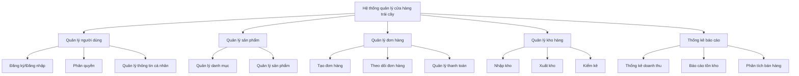
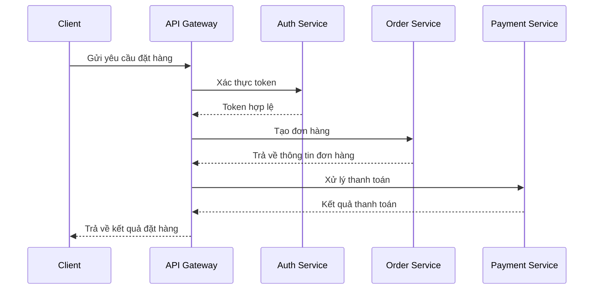
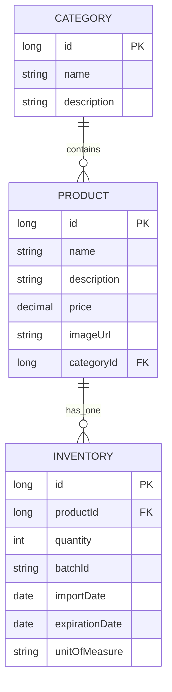
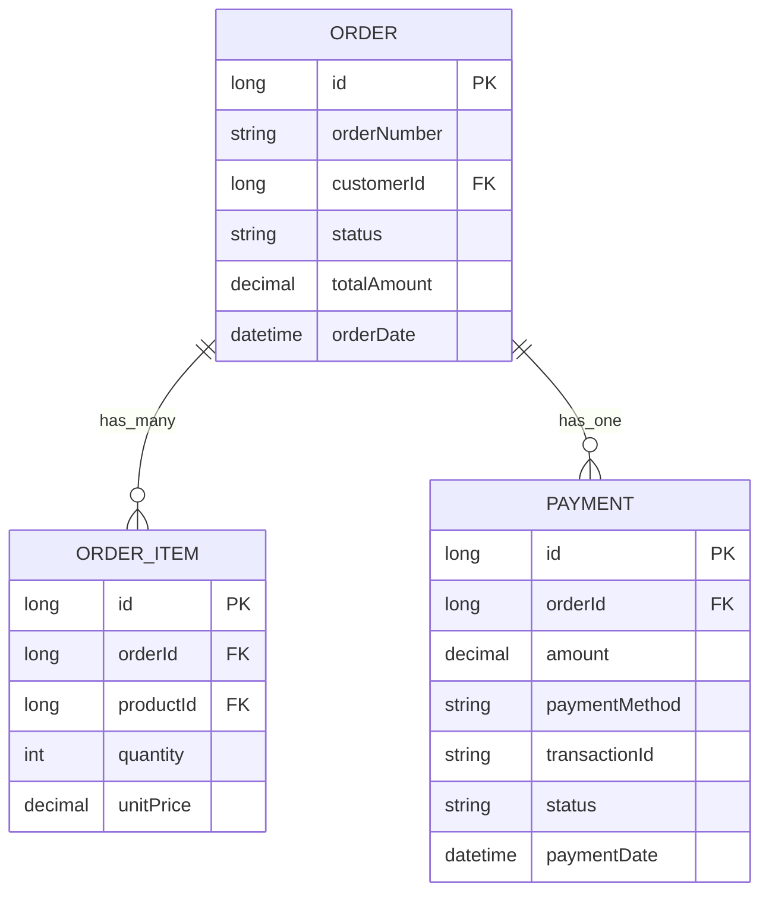
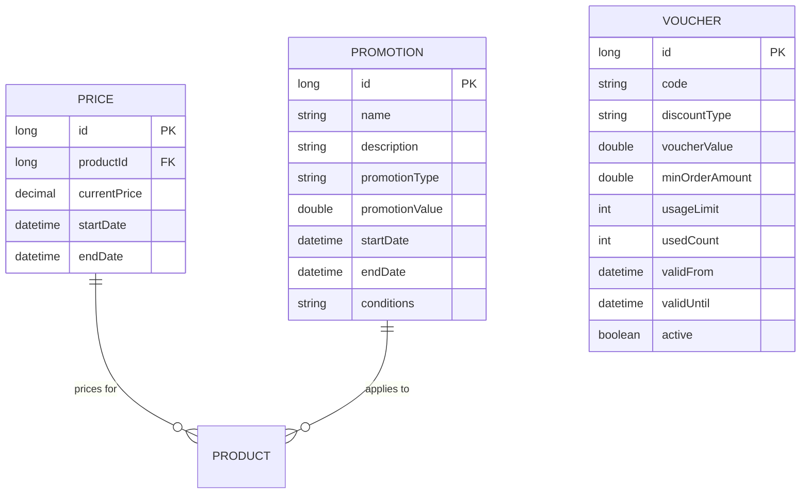
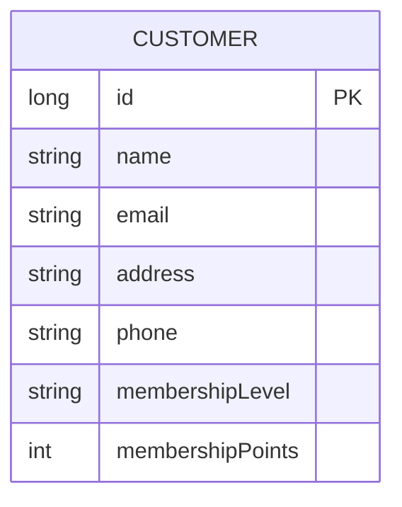
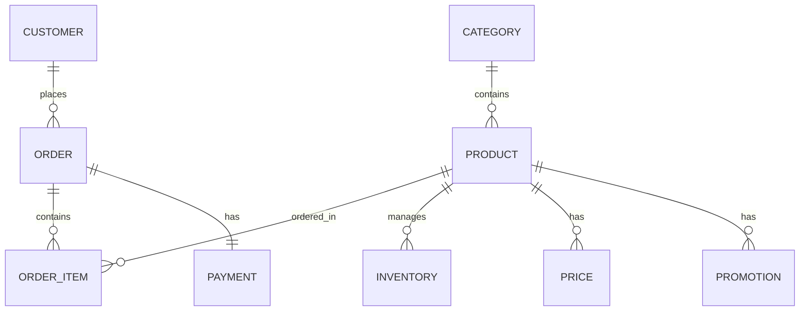
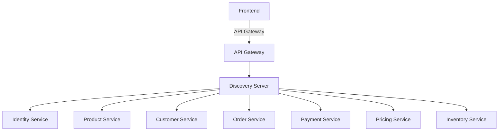

# HỆ THỐNG QUẢN LÝ CỬA HÀNG TRÁI CÂY

## MỤC LỤC

-   [HỆ THỐNG QUẢN LÝ CỬA HÀNG TRÁI CÂY](#hệ-thống-quản-lý-cửa-hàng-trái-cây)
    -   [MỤC LỤC](#mục-lục)
    -   [1. Phát biểu bài toán](#1-phát-biểu-bài-toán)
    -   [2. Tài liệu API](#2-tài-liệu-api)
    -   [3. Phân tích chức năng hệ thống](#3-phân-tích-chức-năng-hệ-thống)
        -   [3.1 Mục tiêu hệ thống](#31-mục-tiêu-hệ-thống)
            -   [Mục tiêu chính](#mục-tiêu-chính)
            -   [Mục tiêu cụ thể](#mục-tiêu-cụ-thể)
        -   [3.2 Yêu cầu chức năng và phi chức năng](#32-yêu-cầu-chức-năng-và-phi-chức-năng)
            -   [Yêu cầu chức năng](#yêu-cầu-chức-năng)
            -   [Yêu cầu phi chức năng](#yêu-cầu-phi-chức-năng)
        -   [3.3 Biểu đồ chức năng](#33-biểu-đồ-chức-năng)
        -   [3.4 Phân rã chức năng thành các dịch vụ](#34-phân-rã-chức-năng-thành-các-dịch-vụ)
        -   [3.5 Mô tả chi tiết các dịch vụ](#35-mô-tả-chi-tiết-các-dịch-vụ)
            -   [3.5.1 Dịch vụ Khách hàng](#351-dịch-vụ-khách-hàng)
            -   [3.5.2 Dịch vụ Xác thực](#352-dịch-vụ-xác-thực)
            -   [3.5.3 Dịch vụ Sản phẩm](#353-dịch-vụ-sản-phẩm)
            -   [3.5.4 Dịch vụ Đơn hàng](#354-dịch-vụ-đơn-hàng)
            -   [3.5.5 Dịch vụ Kho hàng](#355-dịch-vụ-kho-hàng)
            -   [3.5.6 Dịch vụ Định giá](#356-dịch-vụ-định-giá)
            -   [3.5.7 Dịch vụ Thanh toán](#357-dịch-vụ-thanh-toán)
        -   [3.6 Biểu đồ luồng dữ liệu](#36-biểu-đồ-luồng-dữ-liệu)
            -   [Luồng đặt hàng](#luồng-đặt-hàng)
    -   [4. Phân tích và thiết kế dữ liệu](#4-phân-tích-và-thiết-kế-dữ-liệu)
        -   [4.1 Mô hình thực thể liên kết](#41-mô-hình-thực-thể-liên-kết)
            -   [Dịch vụ sản phẩm](#dịch-vụ-sản-phẩm)
            -   [Dịch vụ đơn hàng](#dịch-vụ-đơn-hàng)
            -   [Dịch vụ định giá](#dịch-vụ-định-giá)
            -   [Dịch vụ khách hàng](#dịch-vụ-khách-hàng)
        -   [4.2 Mô hình quan hệ](#42-mô-hình-quan-hệ)
            -   [Quan hệ giữa các bảng chính](#quan-hệ-giữa-các-bảng-chính)
    -   [5. Kiến trúc hệ thống](#5-kiến-trúc-hệ-thống)
        -   [5.1 Tổng quan kiến trúc](#51-tổng-quan-kiến-trúc)
        -   [5.2 Công nghệ sử dụng](#52-công-nghệ-sử-dụng)
            -   [Backend](#backend)
            -   [Frontend](#frontend)
    -   [6. Chi tiết các dịch vụ](#6-chi-tiết-các-dịch-vụ)
        -   [6.1 API Gateway](#61-api-gateway)
        -   [6.2 Discovery Server](#62-discovery-server)
        -   [6.3 Identity Service](#63-identity-service)
        -   [6.4 Product Service](#64-product-service)
        -   [6.5 Order Service](#65-order-service)
        -   [6.6 Payment Service](#66-payment-service)
        -   [6.7 Pricing Service](#67-pricing-service)
        -   [6.8 Inventory Service](#68-inventory-service)
    -   [7. Hướng dẫn cài đặt và chạy](#7-hướng-dẫn-cài-đặt-và-chạy)
        -   [Yêu cầu hệ thống](#yêu-cầu-hệ-thống)
        -   [Các bước cài đặt](#các-bước-cài-đặt)
            -   [Option 1: Dùng Script (Recommended)](#option-1-dùng-script-recommended)
                -   [Windows](#windows)
                -   [Linux/Mac](#linuxmac)
            -   [Option 2: Chạy thủ công](#option-2-chạy-thủ-công)
                -   [Bước 1: Khởi động Discovery Service](#bước-1-khởi-động-discovery-service)
                -   [Bước 2: Khởi động Microservices](#bước-2-khởi-động-microservices)
                -   [Bước 3: Khởi động API Gateway](#bước-3-khởi-động-api-gateway)
                -   [Bước 4: Khởi động Frontend](#bước-4-khởi-động-frontend)
                -   [Bước 5: Truy cập ứng dụng](#bước-5-truy-cập-ứng-dụng)
    -   [8. Kết quả đạt được](#8-kết-quả-đạt-được)
        -   [Chức năng đã hoàn thành](#chức-năng-đã-hoàn-thành)
        -   [Hiệu năng](#hiệu-năng)
    -   [9. Kết luận và hướng phát triển](#9-kết-luận-và-hướng-phát-triển)
        -   [Kết luận](#kết-luận)
        -   [Hướng phát triển](#hướng-phát-triển)
    -   [Tài liệu tham khảo](#tài-liệu-tham-khảo)

## 1. Phát biểu bài toán

<div style="background-color: #f5f5f5; padding: 15px; border-left: 4px solid #4285f4;">
Hệ thống Quản lý Cửa hàng Trái cây được phát triển dựa trên kiến trúc hướng dịch vụ (SOA) với các microservice độc lập, mỗi service đảm nhận một chức năng riêng biệt. Hệ thống bao gồm các service chính: Customer Service, Identity Service, Order Service, Product Service, Inventory Service, Pricing Service, và Payment Service, tất cả được kết nối thông qua API Gateway và được quản lý bởi Discovery Server.
</div>

## 2. Tài liệu API

Chi tiết về các API endpoints, request/response và các thông số kỹ thuật có thể được tìm thấy tại [API Documentation](API_DOCUMENTATION.md).

## 3. Phân tích chức năng hệ thống

### 3.1 Mục tiêu hệ thống

#### Mục tiêu chính

-   Xây dựng hệ thống quản lý bán hàng trực tuyến chuyên nghiệp cho cửa hàng trái cây
-   Tự động hóa quy trình quản lý kho, đơn hàng và thanh toán
-   Cung cấp giao diện thân thiện cho cả khách hàng và quản trị viên

#### Mục tiêu cụ thể

-   Quản lý thông tin sản phẩm, danh mục đa dạng
-   Hỗ trợ đặt hàng và thanh toán trực tuyến
-   Theo dõi tình trạng đơn hàng thời gian thực
-   Quản lý thông tin khách hàng và lịch sử mua hàng
-   Phân tích và báo cáo doanh thu, sản phẩm bán chạy

### 3.2 Yêu cầu chức năng và phi chức năng

#### Yêu cầu chức năng

1. **Quản lý người dùng**

    - Đăng ký, đăng nhập, quên mật khẩu
    - Phân quyền người dùng (admin, nhân viên, khách hàng)
    - Quản lý thông tin cá nhân

2. **Quản lý sản phẩm**

    - Thêm, sửa, xóa sản phẩm và danh mục
    - Tìm kiếm và lọc sản phẩm

3. **Quản lý đơn hàng (Admin/Staff)**

    - Tạo và theo dõi đơn hàng
    - Cập nhật trạng thái đơn hàng
    - Xem lịch sử đơn hàng

4. **Quản lý kho hàng**
    - Nhập/xuất kho
    - Kiểm kê tồn kho
    - Cảnh báo hàng sắp hết

#### Yêu cầu phi chức năng

-   **Hiệu năng**: Thời gian phản hồi < 2s
-   **Bảo mật**: Mã hóa dữ liệu nhạy cảm
-   **Khả năng mở rộng**: Dễ dàng thêm mới dịch vụ
-   **Tính sẵn sàng**: 99.9% uptime
-   **Bảo trì**: Dễ dàng cập nhật và bảo trì

### 3.3 Biểu đồ chức năng



### 3.4 Phân rã chức năng thành các dịch vụ

1. **Dịch vụ Khách hàng (Customer Service)**

    - Tạo và quản lý thông tin khách hàng
    - Quản lý địa chỉ giao hàng
    - Theo dõi lịch sử mua hàng
    - Quản lý cấp độ thành viên

2. **Dịch vụ Xác thực (Identity Service)**

    - Đăng nhập/đăng ký tài khoản
    - Quản lý phiên đăng nhập
    - Phân quyền truy cập
    - Quản lý token JWT

3. **Dịch vụ Sản phẩm (Product Service)**

    - Quản lý danh mục sản phẩm
    - Tìm kiếm và lọc sản phẩm
    - Quản lý thông tin chi tiết sản phẩm

4. **Dịch vụ Đơn hàng (Order Service)**

    - Tạo và quản lý đơn hàng
    - Theo dõi trạng thái đơn hàng
    - Lịch sử đơn hàng

5. **Dịch vụ Kho hàng (Inventory Service)**

    - Quản lý tồn kho sản phẩm
    - Cập nhật số lượng tồn kho
    - Kiểm tra tình trạng tồn kho
    - Cảnh báo hàng sắp hết

6. **Dịch vụ Định giá (Pricing Service)**

    - Quản lý giá sản phẩm
    - Áp dụng khuyến mãi, giảm giá
    - Quản lý voucher
    - Tính toán giá đơn hàng

7. **Dịch vụ Thanh toán (Payment Service)**
    - Xử lý thanh toán đơn hàng
    - Quản lý phương thức thanh toán
    - Hoàn tiền và xử lý khiếu nại
    - Lịch sử giao dịch

### 3.5 Mô tả chi tiết các dịch vụ

#### 3.5.1 Dịch vụ Khách hàng

-   **API Endpoints**:
    -   `POST /api/customer`: Tạo mới khách hàng
    -   `GET /api/customer/{id}`: Lấy thông tin chi tiết khách hàng
    -   `PUT /api/customer/{id}`: Cập nhật thông tin khách hàng
    -   `DELETE /api/customer/{id}`: Xóa khách hàng
    -   `GET /api/customer/{id}/orders`: Lấy lịch sử đơn hàng của khách hàng

#### 3.5.2 Dịch vụ Xác thực

-   **API Endpoints**:
    -   `POST /api/auth/token`: Lấy token đăng nhập
    -   `POST /api/auth/validate`: Xác thực token
    -   `POST /api/auth/refresh`: Làm mới token
    -   `GET /api/auth/user`: Lấy thông tin người dùng hiện tại

#### 3.5.3 Dịch vụ Sản phẩm

-   **API Endpoints**:
    -   `GET /api/product`: Lấy danh sách sản phẩm
    -   `GET /api/product/{id}`: Lấy chi tiết sản phẩm
    -   `POST /api/product`: Thêm sản phẩm mới
    -   `PUT /api/product/{id}`: Cập nhật sản phẩm
    -   `DELETE /api/product/{id}`: Xóa sản phẩm
    -   `GET /api/category`: Lấy danh mục sản phẩm
    -   `POST /api/category`: Thêm danh mục mới

#### 3.5.4 Dịch vụ Đơn hàng

-   **API Endpoints**:
    -   `POST /api/order`: Tạo đơn hàng mới
    -   `GET /api/order/{id}`: Lấy chi tiết đơn hàng
    -   `PUT /api/order/{id}/status`: Cập nhật trạng thái đơn hàng
    -   `GET /api/order/customer/{customerId}`: Lấy đơn hàng theo khách hàng
    -   `DELETE /api/order/{id}`: Hủy đơn hàng

#### 3.5.5 Dịch vụ Kho hàng

-   **API Endpoints**:
    -   `GET /api/inventory/product/{productId}`: Kiểm tra tồn kho sản phẩm
    -   `POST /api/inventory/update`: Cập nhật số lượng tồn kho
    -   `GET /api/inventory/low-stock`: Lấy danh sách sản phẩm sắp hết hàng
    -   `POST /api/inventory/alert`: Thiết lập cảnh báo tồn kho

#### 3.5.6 Dịch vụ Định giá

-   **API Endpoints**:
    -   `GET /api/pricing/price/{productId}`: Lấy giá sản phẩm
    -   `POST /api/pricing/calculate`: Tính toán giá đơn hàng
    -   `POST /api/pricing/discount`: Áp dụng khuyến mãi
    -   `POST /api/pricing/voucher/apply`: Áp dụng voucher
    -   `GET /api/pricing/voucher/validate`: Kiểm tra voucher

#### 3.5.7 Dịch vụ Thanh toán

-   **API Endpoints**:
    -   `POST /api/payment/process`: Xử lý thanh toán
    -   `GET /api/payment/status/{orderId}`: Kiểm tra trạng thái thanh toán
    -   `POST /api/payment/refund`: Yêu cầu hoàn tiền
    -   `GET /api/payment/history`: Lịch sử giao dịch

### 3.6 Biểu đồ luồng dữ liệu

#### Luồng đặt hàng



## 4. Phân tích và thiết kế dữ liệu

### 4.1 Mô hình thực thể liên kết

#### Dịch vụ sản phẩm



#### Dịch vụ đơn hàng



#### Dịch vụ định giá



#### Dịch vụ khách hàng



### 4.2 Mô hình quan hệ

#### Quan hệ giữa các bảng chính



## 5. Kiến trúc hệ thống

### 5.1 Tổng quan kiến trúc



### 5.2 Công nghệ sử dụng

#### Backend

-   **Spring Boot/Cloud**: Xây dựng các microservices
-   **Spring Cloud Gateway**: API Gateway
-   **Eureka**: Service Discovery
-   **Spring Security**: Xác thực và phân quyền
-   **Spring Data JPA**: Truy vấn dữ liệu
-   **H2**: Cơ sở dữ liệu in-memory

#### Frontend

-   **React.js**: Giao diện người dùng
-   **Axios**: Gọi API
-   **Bootstrap 5**: Component UI
-   **React Router**: Định tuyến trang

## 6. Chi tiết các dịch vụ

### 6.1 API Gateway

-   Điểm vào duy nhất cho tất cả các yêu cầu
-   Định tuyến request đến các dịch vụ tương ứng
-   Xử lý xác thực và phân quyền
-   Cân bằng tải và giới hạn tốc độ

### 6.2 Discovery Server

-   Đăng ký và phát hiện dịch vụ
-   Theo dõi trạng thái các dịch vụ
-   Hỗ trợ cân bằng tải động

### 6.3 Identity Service

-   Quản lý người dùng và phân quyền
-   Xác thực thông qua JWT
-   Quản lý phiên đăng nhập

### 6.4 Product Service

-   Quản lý danh mục sản phẩm
-   Tìm kiếm và lọc sản phẩm

### 6.5 Order Service

-   Tạo và quản lý đơn hàng
-   Theo dõi trạng thái đơn hàng
-   Lịch sử đặt hàng

### 6.6 Payment Service

-   Tích hợp cổng thanh toán
-   Quản lý giao dịch
-   Hoàn tiền và khiếu nại

### 6.7 Pricing Service

-   Quản lý giá cả và khuyến mãi
-   Tính toán giảm giá
-   Chính sách giá theo mùa

### 6.8 Inventory Service

-   Quản lý tồn kho
-   Cảnh báo hàng hết hàng
-   Đồng bộ số lượng tồn

## 7. Hướng dẫn cài đặt và chạy

### Yêu cầu hệ thống

-   JDK 11+
-   Maven 3.6+
-   Node.js 14+

### Các bước cài đặt

#### Option 1: Dùng Script (Recommended)

##### Windows

```bash
# Double click vào file
run.bat
```

##### Linux/Mac

```bash
# Chạy ở terminal
chmod +x run.sh
./run.sh start
```

Script sẽ:

1. Khởi động Discovery Service (Eureka)
2. Khởi động tất cả microservices song song
3. Khởi động API Gateway
4. Khởi động frontend (React)

#### Option 2: Chạy thủ công

##### Bước 1: Khởi động Discovery Service

```bash
cd backend/discovery-server
mvn spring-boot:run
```

Chờ server khởi động hoàn tất trên cổng `8761`

##### Bước 2: Khởi động Microservices

Mở các cửa sổ terminal riêng biệt cho từng service:

```bash
# Terminal 2: Product Service
cd backend/product-service
mvn spring-boot:run

# Terminal 3: Inventory Service
cd backend/inventory-service
mvn spring-boot:run

# Terminal 4: Pricing Service
cd backend/pricing-service
mvn spring-boot:run

# Terminal 5: Order Service
cd backend/order-service
mvn spring-boot:run

# Terminal 6: Customer Service
cd backend/customer-service
mvn spring-boot:run

# Terminal 7: Payment Service
cd backend/payment-service
mvn spring-boot:run
```

##### Bước 3: Khởi động API Gateway

```bash
cd backend/api-gateway
mvn spring-boot:run
```

##### Bước 4: Khởi động Frontend

```bash
cd frontend
npm run dev
```

##### Bước 5: Truy cập ứng dụng

-   **Frontend**: http://localhost:5173
-   **API Gateway**: http://localhost:8080
-   **Eureka Dashboard**: http://localhost:8761
-   **H2 Console** (Cho mỗi service): http://localhost:{port}/h2-console
    -   Product Service: http://localhost:8086/h2-console
    -   Customer Service: http://localhost:8081/h2-console
    -   Identity Service: http://localhost:8087/h2-console
    -   Inventory Service: http://localhost:8082/h2-console
    -   Order Service: http://localhost:8083/h2-console
    -   Payment Service: http://localhost:8084/h2-console
    -   Pricing Service: http://localhost:8085/h2-console

## 8. Kết quả đạt được

### Chức năng đã hoàn thành

-   [x] Đăng nhập người dùng (Admin/Staff)
-   [x] Quản lý sản phẩm và danh mục
-   [x] Quản lý đơn hàng
-   [x] Theo dõi đơn hàng và trạng thái thanh toán
-   [x] Quản lý kho hàng
-   [x] Quản lý khuyến mãi và voucher
-   [x] Quản lý khách hàng (tạo, sửa, xóa thông tin)

### Hiệu năng

-   Thời gian phản hồi trung bình: < 500ms
-   Hỗ trợ hàng nghìn người dùng đồng thời
-   Khả năng mở rộng theo chiều ngang

## 9. Kết luận và hướng phát triển

### Kết luận

Hệ thống đã đáp ứng được các yêu cầu cơ bản của một cửa hàng trái cây trực tuyến, với kiến trúc microservice giúp dễ dàng mở rộng và bảo trì.

### Hướng phát triển

-   Phát triển giao diện khách hàng (Customer Portal) để khách hàng tự đặt hàng
-   Tích hợp thêm các phương thức thanh toán (VNPay, Momo, v.v.)
-   Phát triển ứng dụng di động
-   Tích hợp AI để gợi ý sản phẩm
-   Tích hợp hệ thống đánh giá sản phẩm
-   Mở rộng hệ thống đa ngôn ngữ

## Tài liệu tham khảo

1. Tài liệu Spring Boot: https://spring.io/projects/spring-boot
2. Tài liệu Spring Cloud: https://spring.io/projects/spring-cloud
3. Tài liệu React: https://react.dev/learn
4. Tài liệu Microservices Architecture: https://microservices.io/
